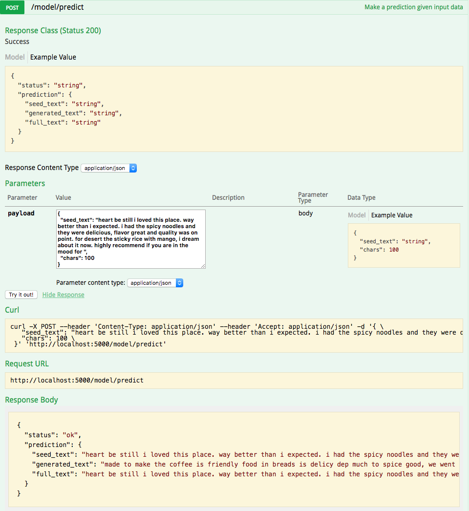

# IBM Code Model Asset Exchange: Char-RNN Generative Language Model on Yelp Reviews

This repository contains code to instantiate and deploy a language generation model. The model generates English-language text similar to the text in the [Yelp® review data set](https://www.kaggle.com/c/yelp-recruiting/data). The model consists of a recurrent neural network with 2 LSTM layers that was trained on the Yelp® reviews data. The input to the model is a piece of text used to seed the generative model, and the output is a piece of generated text.

The model is based on the [IBM Code Pattern: Training a Deep Learning Language Model Using Keras and Tensorflow](https://github.com/IBM/deep-learning-language-model). The model files are hosted on [IBM Cloud Object Storage](http://max-assets.s3-api.us-geo.objectstorage.softlayer.net/keras/generative_lang_model/generative_lang_model.h5). The code in this repository deploys the model as a web service in a Docker container. This repository was developed as part of the [IBM Code Model Asset Exchange](http://www.example.com).

## Model Metadata
| Domain | Application | Industry  | Framework | Training Data | Input Data Format |
| ------------- | --------  | -------- | --------- | --------- | -------------- | 
| Text/NLP | Language Modeling | General | Keras | [Kaggle Yelp Reviews Dataset](https://www.kaggle.com/c/yelp-recruiting/data) | Text | 

## References

* _Hochreiter, S. and Schmidhuber, J._, ["Long short-term memory"](http://www.bioinf.jku.at/publications/older/2604.pdf), Neural Computation 9(8):1735-1780, 1997.
* [Keras RNN Layers - LSTM](https://keras.io/layers/recurrent/#lstm)

## Licenses

| Component | License | Link  |
| ------------- | --------  | -------- |
| This repository | [Apache 2.0](https://www.apache.org/licenses/LICENSE-2.0) | [LICENSE](LICENSE) |
| Model Weights | [Apache 2.0](https://www.apache.org/licenses/LICENSE-2.0) | [LICENSE](LICENSE) |
| Test assets | Various | [Asset README](assets/README.md) |

## Pre-requisites:

* `docker`: The [Docker](https://www.docker.com/) command-line interface. Follow the [installation instructions](https://docs.docker.com/install/) for your system.
* The minimum recommended resources for this model is 2GB Memory and 2 CPUs.

## Steps

1. [Build the Model](#1-build-the-model)
2. [Deploy the Model](#2-deploy-the-model)
3. [Use the Model](#3-use-the-model)
4. [Development](#4-development)
5. [Clean Up](#5-clean-up)

## 1. Build the Model

Clone the `MAX-generative-language-model` repository locally. In a terminal, run the following command:

```
$ git clone https://github.ibm.com/IBMCode/MAX-generative-language-model
```

Change directory into the repository base folder:

```
$ cd MAX-generative-language-model
```

To build the docker image locally, run: 

```
$ docker build -t max-keras-langmodel .
```

All required model assets will be downloaded during the build process. _Note_ that currently this docker image is CPU only (we will add support for GPU images later).


## 2. Deploy the Model

To run the docker image, which automatically starts the model serving API, run:

```
$ docker run -it -p 5000:5000 max-keras-langmodel
```

## 3. Use the Model

The API server automatically generates an interactive Swagger documentation page. Go to `http://localhost:5000` to load it. From there you can explore the API and also create test requests.

Use the `model/predict` endpoint to post a snippet of text to seed the model (you can use one of the text snippets from the `assets` folder) and get generated text from the API. You can also specify the number of characters to generate in the `chars` field in the JSON request (`100` by default). The maximum length of an input text snippet is set at `256` characters, and the input you post will be truncated to that length before generating text.

*Note* the API call may take a while to complete as it takes some time for the model to generate the text.



You can also test it on the command line, for example:

```
$ curl -X POST --header 'Content-Type: application/json' -d '{"seed_text": "heart be still i loved this place. way better than i expected. i had the spicy noodles and they were delicious, flavor great and quality was on point. for desert the sticky rice with mango, i dream about it now. highly recommend if you are in the mood for "}' 'http://localhost:5000/model/predict'
```

You should see a JSON response that looks something like that below. *Note, however,* that since the character generation step uses random sampling, you should expect to get different results in the `generated_text` field in your response.

```json
{
  "status": "ok",
  "prediction": {
    "seed_text": "heart be still i loved this place. way better than i expected. i had the spicy noodles and they were delicious, flavor great and quality was on point. for desert the sticky rice with mango, i dream about it now. highly recommend if you are in the mood for ",
    "generated_text": "made to make the coffee is friendly food in breads is delicy dep much to spice good, we went and bee",
    "full_text": "heart be still i loved this place. way better than i expected. i had the spicy noodles and they were delicious, flavor great and quality was on point. for desert the sticky rice with mango, i dream about it now. highly recommend if you are in the mood for made to make the coffee is friendly food in breads is delicy dep much to spice good, we went and bee"
  }
}
```

## 4. Development

To run the Flask API app in debug mode, edit `config.py` to set `DEBUG = True` under the application settings. You will then need to rebuild the docker image (see [step 1](#1-build-the-model)).

